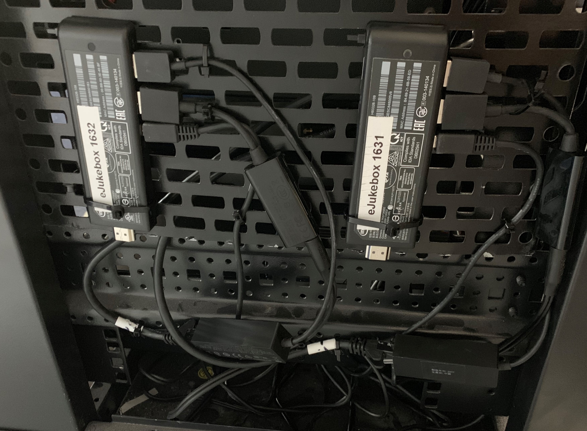
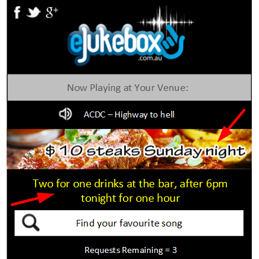
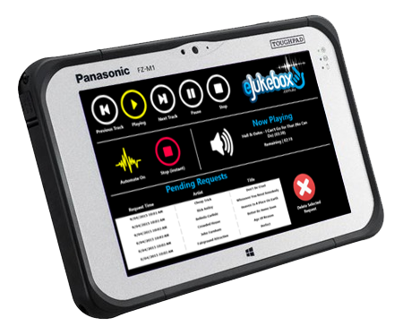
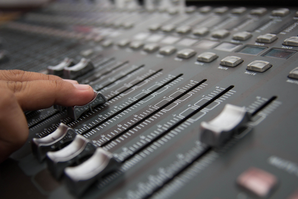
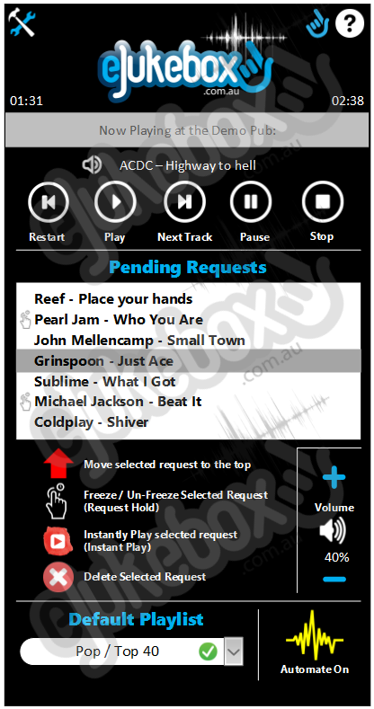

[//]: # (margin:top right bottom left)

## What is **eJukebox**?

**eJukebox** is a technically advanced jukebox that accepts requests from a mobile phone and also plays music 24/7 throughout the entirety of a venue where it is setup. It can plug into any existing sound system and can easily extend to cover any size venue.  **eJukebox** is a jukebox that is controlled by a smartphone which replaces a DJ on most occasions. Lets face it, a normal DJ just stands in the corner and presses buttons mostly playing what they've been told to from the person that hired them. Instead, everyone can be the DJ choosing their own songs on their smartphone where ever they are without the need to stand in front of an actual jukebox. **eJukebox** is available for private function hire/rental or is available as a permanent music solution. We are a popular music provider and an obvious choice for venues such as pubs or clubs.

The **eJukebox** music system has arguably the largest collection of music with all the newest music, we have a full music library with all the latest music thanks to regular new music releases from all the major record companies.  

### At the pub, behind the scenes
This is what **eJukebox** looks like installed at the venue. **eJukebox** is zero touch, they are nested away in the backend never to be seen by anyone. **eJukebox** is cloud connected, fully managed with realtime automatic updates to music. 

Below is an actual **eJukebox** installation at one of our larger customers, two jukebox systems (one for each zone). Maybe small, but these little devices are state of the art running the latest **Windows 10** OS. As for the reliability aspect, these little **Intel** compute sticks have been installed since 2018 and haven't had any issues at all. Reliability is due the solid state nature of the device with an Intel chipset. Less moving parts means less can go wrong and maintenance is reduced to virtually nothing. The hard drive is solid state, there's a local solid state cache and with cloud connectivity. As these systems are zero touch, they update by themselves from the cloud.
- State of the art USB audio adapter which plugs directly into the existing audio system
- USB ethernet adaptor for wired ethernet, as WiFi is horrendously unreliable
- State of the art audio processing for unbeatable sound quality

If the internet drops out, no problems, customers notice nothing. These devices carry a backup music library and can keep playing for an infinite period of time until which time the internet comes back up again.

The best part about these little devices, they are massively cost effective and significantly cheaper to run and to sign up to. With a much lower foot print, fully managed and automated, we pass these savings on to you. 

### What your customers see

Thanks to the magic of the cloud & IoT, customers connect to a fast, reliable & responsive cloud based website in which they can:
- request songs
- see the current playing song
- see requests in the queue

**eJukebox** allows the punter to use their existing smartphone to access a request portal. The request portal is used to request songs, see pending requests, see the current song playing now and see the top requested songs. The request portal doesn't care what type of smartphone the punter has as it doesn't need an app, it simply runs as a website designed to fit on a small screen.

As an example, feel free to have a play with our live online jukebox: https://one.ejukebox.net You can listen to it here 

<audio controls="controls">
  <source type="audio/mp3" src="[https://streaming.live365.com/a77569]"></source>
  
Your browser does not support the audio element.

</audio>

### What to hear it for yourself?

gg
gg
gg
g
g
g

### A totally automated jukebox music solution

**eJukebox** is new and hip. While all other music solutions are all static, eJukebox is the only totally automated shared music solution which is totally dynamic. eJukebox is exactly like a conventional jukebox, except much newer - conventional jukeboxes are old school. An old school jukebox is a static device that sits on a wall or in the corner of a room, whereas eJukebox is today's technology in a jukebox eliminating the need to be anti-social lining up or standing in front of a jukebox for ages browsing through songs. There are many other leading features that make our jukeboxes better than a standard jukebox, the biggest difference is that our jukebox is totally controlled by a smartphone from practically anywhere the music is heard.

**Who needs a DJ, when everyone can be the DJ**. With an eJukebox system, all your customers become the DJ, they can browse through all the music available on eJukebox conveniently from their smartphone, then they can choose a song straight away at the same time while holding a drink in the other hand. Customers can see what songs have been requested by everyone and see when their song is coming up. 

As **eJukebox** is interactive, it will bring people closer together in an environment where they can interact with one another with excitement. Background music won't remain background music any longer, it will become one of the primary topics of conversation. 

### Our Jukebox is eJukebox

- This is eJukebox, a small tablet computer which is packed with over 7000 high quality songs on a solid-state hard drive  
- Customers request songs using any smartphone - Apple iOS, Android, Windows Phone or BlackBerry - no app required  
- eJukebox runs on a 7" Panasonic Toughpad, it is strong enough to withstand the harshest conditions. It is Lightweight, extremely reliable (no moving parts) and is ultra portable.  
- The music library is updated and sync'ed hourly from the eJukebox cloud and is sourced from the major record companies, Universal, Sony, EMI, Warner, Ministry Of Sound, Liberation, Inertia, Mushroom and more  
- We have established agreements with all the major record companies. We receive all the same pop music at the same time that commercial radio stations receive their music

### The best sound quality

- The quality of our audio is second to none. We use similar audio processing to that of radio stations. All music is processed in real-time using a Multiband Automatic Gain Control (AGC) Limiter  
- All songs played with eJukebox are perfectly mixed with one another  
- Not like an iPod or a CD, our music system has no gaps between songs  
- eJukebox uses music automation software just like radio stations allowing all songs to be intelligently mixed. No matter if a song ends cold or fades out gradually, the finished product that you hear through the speakers will make you think a DJ has mixed it professionally

### eJukebox Controller App

- Designed by a DJ, this app allows anyone to be the DJ at an event or venue right from a smartphone using one hand and holding a drink in the other hand  
- Having a wedding? You don't need to pay for your own DJ, this app will do everything that a real DJ can do including gracefully stopping the music for speeches plus lining up and playing specific songs for cutting of the cake, first dance, garter toss, bouquet toss etc  
- Walk around, be a part of the event, mingle, drink and enjoy yourself, eJukebox normally runs automatically mixing songs together beautifully playing requests while you have ultimate control if needed right from the palm of your hand  
- The controller app is available for iOS/Android and is available for eJukebox hire and permanent venue placement
